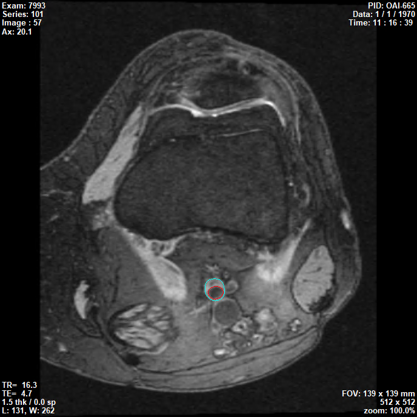

# OAI-Polar
Vessel wall segmentation labels from the OAI dataset for training FRAPPE. 

To use the labels, please kindly cite our paper
Chen L, Canton G, Liu W, et al. Fully automated and robust analysis technique for popliteal artery vessel wall evaluation (FRAPPE) using neural network models from standardized knee MRI. Magn Reson Med. 2020;84:2147–2160. https://doi.org/10.1002/mrm.28237

Due to the data sharing policy, we cannot post original images here. Please acquire the images from https://nda.nih.gov/oai/

There are four datasets posted here. Train and validation sets are used for developing FRAPPE from the baseline scans in the OAI dataset. After development, Rep set is used to evaluate the reproducibility between FRAPPE vs human reviewer 1, FRAPPE vs human reviewer 2, and human reviewer 1 vs human reviewer 2. Finally, the test set (half labeled by human reviewer 1 and half by human reivewer 2) is used to report segmentation accuracy. 
23 cases for training, 2 for validation, 10 for reproducibility, 25 for testing. 

Pid and Eid and subject and scan id from the OAI dataset
VTSPID and VTSEID are the remaned id in our system

Timepoint(s)	Pid	Eid	VTSPID	VTSEID	Side	Reviewer	Dataset
V00/BL	9118689	10195407	OAI-665	7993	L	G	Train
V00/BL	9126497	10716807	OAI-625	92924	L	G	Train
V00/BL	9127864	10583105	OAI-262	14657	L	G	Train
V00/BL	9145541	10180107	OAI-685	10395	L	G	Train
V00/BL	9154516	10728007	OAI-747	65082	L	G	Train
V00/BL	9159961	10127307	OAI-14	42953	L	G	Train
V00/BL	9160801	10519109	OAI-478	29902	L	G	Train
V00/BL	9191054	10729308	OAI-768	81844	L	G	Train
V00/BL	9242956	10503008	OAI-835	84986	L	G	Train
V00/BL	9379540	10836207	OAI-333	77561	L	G	Train
V00/BL	9422008	10339808	OAI-235	7766	L	G	Train
V00/BL	9564520	10423309	OAI-135	49324	L	G	Train
V00/BL	9618705	10210907	OAI-675	30925	L	G	Train
V00/BL	9620472	10691417	OAI-984	79874	L	G	Train
V00/BL	9621886	10481307	OAI-887	39592	L	G	Train
V00/BL	9676775	10675407	OAI-933	31850	L	G	Train
V00/BL	9684366	10034105	OAI-750	47849	L	G	Train
V00/BL	9698638	10493907	OAI-886	22631	L	G	Train
V00/BL	9809469	10085707	OAI-924	77140	L	G	Train
V00/BL	9833361	10270305	OAI-536	27323	L	G	Train
V00/BL	9861824	10551008	OAI-92	34548	L	G	Train
V00/BL	9886746	10881704	OAI-413	27827	L	G	Train
V00/BL	9932333	10301007	OAI-550	66158	L	G	Train
V00/BL	9714513	10068707	OAI-147	27172	L	G	Validation
V00/BL	9848855	10075707	OAI-472	25300	L	G	Validation
V03/24M	9073948	20071017L	OAI-277	92387	L	B	Rep
V06/48M	9494408	20080722L	OAI-280	96481	L	B	Rep
V00/BL	9577425	10459613R	OAI-426	66137	R	B	Rep
V00/BL	9590486	10434007L	OAI-266	11988	L	B	Rep
V05/36M	9708289	20071126R	OAI-215	91079	R	B	Rep
V00/BL	9709257	10693307L	OAI-284	96331	L	B	Rep
V00/BL	9757487	10213608L	OAI-344	45138	L	B	Rep
V00/BL	9788979	10787708L	OAI-447	48598	L	B	Rep
V06/48M	9813780	20081204R	OAI-466	85410	R	B	Rep
V00/BL	9918649	11096808L	OAI-479	16649	L	B	Rep
V00/BL	9126648	11164007L	OAI-409	34637	L	W	Test
V10/96M	9184556	20130909L	OAI-465	4010	L	W	Test
V00/BL	9210045	10735313R	OAI-244	80374	R	G	Test
V06/48M	9363262	20090727L	OAI-806	99375	L	G	Test
V10/96M	9415301	20130822L	OAI-524	58681	L	W	Test
V10/96M	9475264	20120716R	OAI-613	45262	R	G	Test
V00/BL	9534036	10895310R	OAI-406	69091	R	W	Test
V05/36M	9546108	20081119R	OAI-811	74797	R	W	Test
V10/96M	9558136	20130925L	OAI-116	25863	L	G	Test
V03/24M	9563176	20060321L	OAI-68	89629	L	G	Test
V03/24M	9564729	20071030R	OAI-448	43032	R	W	Test
V00/BL	9629890	10482907L	OAI-23	88935	L	W	Test
V03/24M	9693599	20071113R	OAI-325	17797	R	G	Test
V00/BL	9746220	10168913R	OAI-764	69703	R	G	Test
V00/BL	9783798	10081107L	OAI-900	38192	L	W	Test
V01/12M	9821872	20051222R	OAI-968	98683	R	G	Test
V05/36M	9876792	20080513L	OAI-581	49710	L	W	Test
V03/24M	9902757	20061221L	OAI-307	25869	L	G	Test
V10/96M	9911265	20130408L	OAI-635	14448	L	W	Test
V05/36M	9916542	20080902R	OAI-703	98030	R	W	Test
V00/BL	9919023	10771115R	OAI-938	33274	R	G	Test
V03/24M	9926617	20070515L	OAI-418	99467	L	G	Test
V03/24M	9968721	20070725L	OAI-518	95004	L	W	Test
V08/72M	9981798	20101229R	OAI-362	48627	R	G	Test
V00/BL	9858512	10476330R	OAI-433	80459	R	W	Test

Human labeled contours using an inhouse annotation tool (CASCADE, doi: 10.1097/rmr.0b013e3181598d9d). Results are saved in the XML format. Please see the Contour_Point node for contour coordinates. Please note that all images were resized to 512*512 before labeling in CASCADE. 